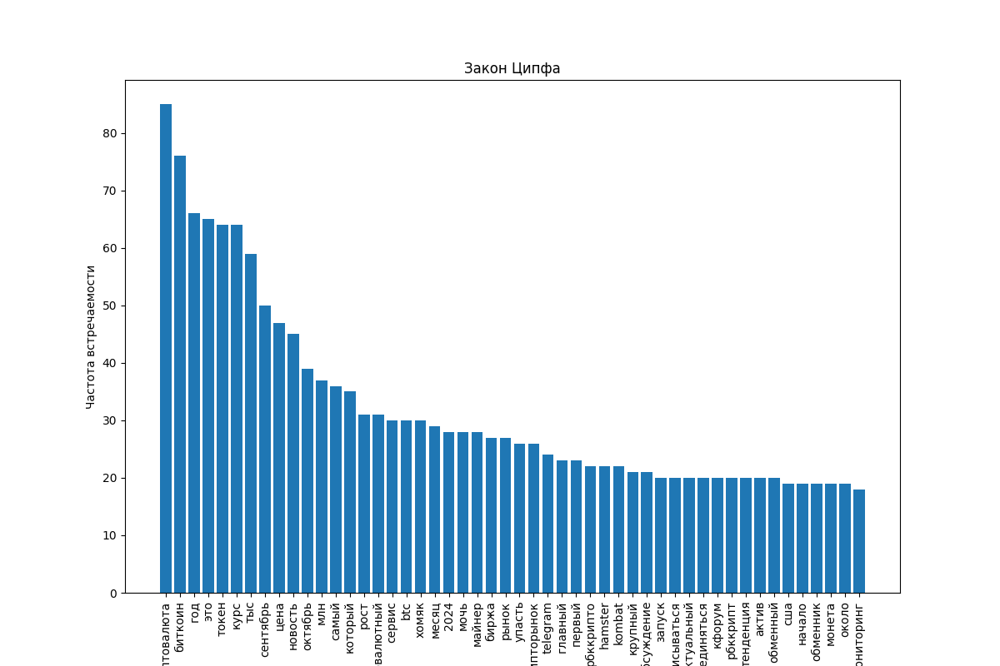
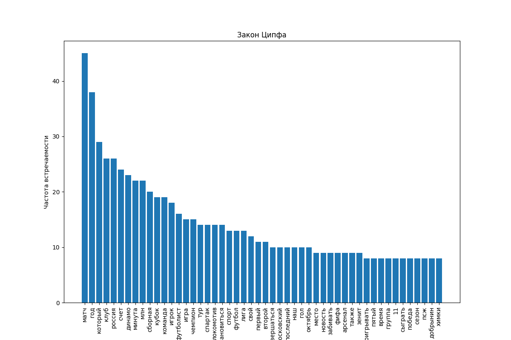
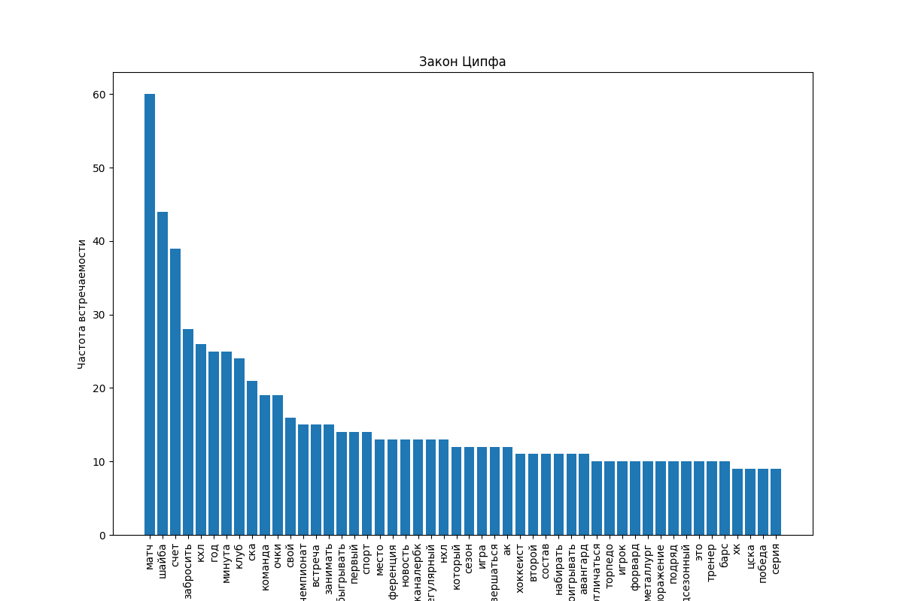
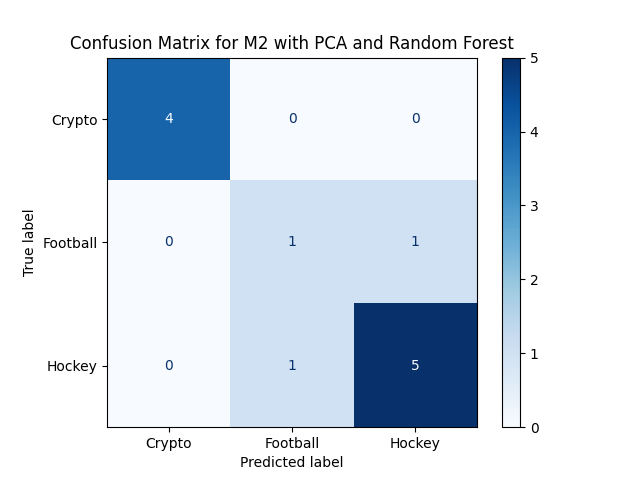
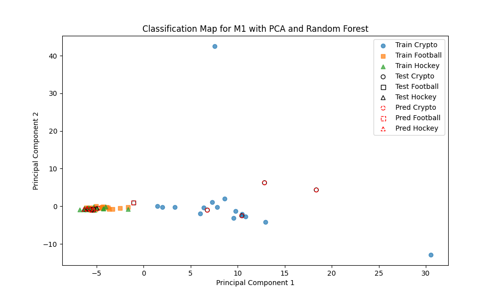
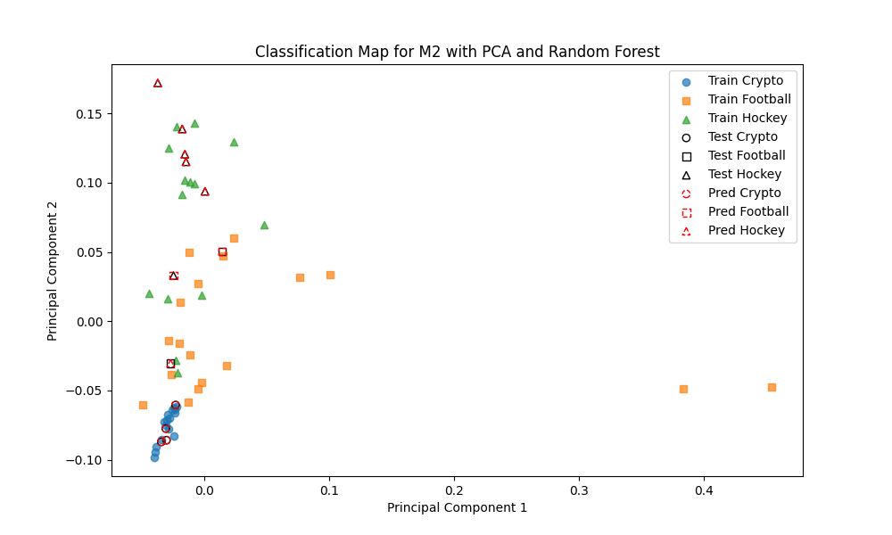

# classifierNews
## TASK

- Подготовить (очистить, нормализовать и т. д.) обучающие и контрольные наборы данных.  
✅ TextProcessing/processing.py
- Проверить закон Ципфа на 2–3 документах или всей коллекции.  
✅ Zipf/Zipf.py  
  
  
  
- Построить матрицу M1 терм-документ на основе мешка слов.  
✅ BagWords/Main.py
- Построить матрицу M2 терм-документ на основе Tf-Idf.  
✅ TfIDF/Main.py
- Найти биграммы и триграммы.  
✅  
[newsCryptoProcessed_classification_results.txt](newsCryptoProcessed_classification_results.txt)  
[newsFootballProcessed_classification_results.txt](newsFootballProcessed_classification_results.txt)  
[newsHockeyProcessed_classification_results.txt](newsHockeyProcessed_classification_results.txt)  
- Выбрать эффективную размерность пространства.  
✅
- Решить задачу классификации на основе матриц M1 и M2.
✅
- Оценить качество работы классификаторов на тестовых данных (accuracy, precision, recall, f1-score, confusion matrix…).  
✅  
  
  
[classification_results_M1.txt](classification_results_M1.txt)  
[classification_results_M2.txt](classification_results_M2.txt)  
- Построить карту классификации (2D).  
✅

- Решить задачу ранжирования документов на основе
поискового запроса.